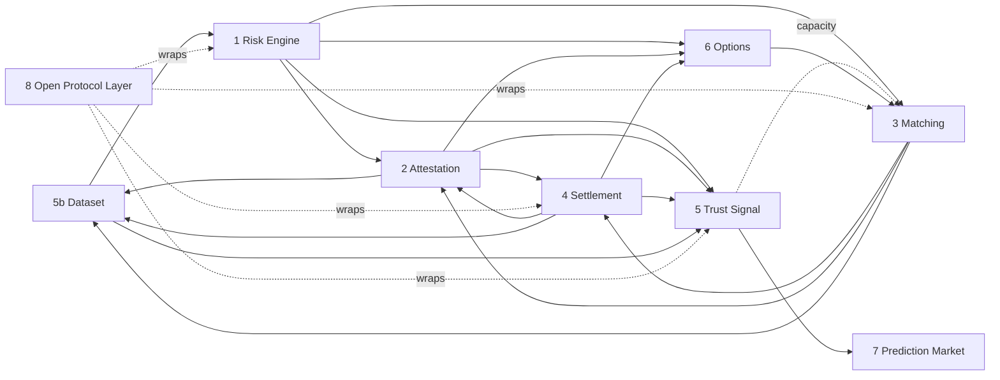

# Component architecture — synthesis

## 1. The one principle every card converged on

**Rules open, state closed.** Across all nine cards, every surface classified "closed" is *state* — the live book, the pre-commit residual, the routing schedule, the hedge book, the raw corpus — and never an *algorithm*. No card found a rule that must stay secret; several found that a secret rule would breach the axiom it enacts (an unauditable ledger is where extraction hides; an unauditable engine cannot prove it does not extract — A9). This is A13 rendered as an engineering rule, and it is the open-source strategy in one line: **publish every rule; withhold only state.**

## 2. The components

| # | Component | Trust class | Coverage | Enacts (v13) | What is closed, and why |
|---|---|---|---|---|---|
| 1 | Risk Engine | NEEDS_REFERENCE_IMPL | PARTIAL | A2, A8, A3 | Nothing by right; closed in practice because the normalisation is not numerically specified |
| 2 | Attestation | NEEDS_REFERENCE_IMPL | PARTIAL | A13 entire, A2, A8, A9 | Nothing by right; the boundary parameter (granularity, lag) is unset |
| 3 | Matching Engine | NEEDS_REFERENCE_IMPL | PARTIAL | A4, A9, A5; T12, T14, T20, T64 | Live book, pre-commit residual, routing schedule — state (A13, F7) |
| 4 | Settlement Layer | STRANGER_BUILDABLE | PARTIAL | A5, A9; T21, T42, T44, Stock-Flow | Nothing — parameters are published governance inputs |
| 5 | Trust Signal (INDX) | STRANGER_BUILDABLE | PARTIAL | A8, A7, A3, A5, A13 | Nothing — a pure function of public inputs |
| 5b | Dataset | NEVER_OPEN (corpus) / open (interface) | PARTIAL | α-loop theorem, A2, A8, A13, T51, T55, T30 | The corpus: opening it erases the inside/outside asymmetry and breaches consent |
| 6 | Options Layer | NEEDS_REFERENCE_IMPL | PARTIAL | A3, A5, A2/A8; T41 | Live inventory and hedge book — state (A9) |
| 7 | Prediction Market | STRANGER_BUILDABLE | MISSING | consumes A2/A8; tests A13 | Nothing. **Verdict: product on 5 + 6, not a component** — until its price is wired into allocation |
| 8 | Open Protocol Layer | NEEDS_REFERENCE_IMPL | PARTIAL | A3, A14, A13; T57, T30, T58 | Nothing — interface specs are the canonical open artefact |

Every card rated coverage PARTIAL where the spec's own §11 matrix says "Full". The matrix measures document presence; the cards measure implementability. Both are true.

## 3. Dependency structure

The graph has cycles (1 ↔ 5b, 2 ↔ 3/4, 3 ↔ 6). They are real — the system is a loop by design (P0 → … → loop). For *building*, every cycle is cut at an **interface contract**: the record schema (5b) precedes the engine (1); the attestation record format (2) precedes match and settlement events (3, 4); the capacity envelope (3) precedes options sizing (6). Build order is therefore an order of **schemas and parameters**, not of components. Pass 3 (`SEQUENCE.md`) follows from this.

## 4. Cross-cutting invariants and their owners

Four clauses were claimed by more than one card. None is a conflict; each is one rule with several enforcement points, and one owner.

| Invariant | Owner | Enforced also by |
|---|---|---|
| **Cycle atomicity** — postings commit whole or not at all, no partial state externally visible (demoted A16) | 3 — only the matching engine defines the cycle | 4 (posting durability), 2 (records whole cycles only), 5 (no partial composition) |
| **Netting identity** — netted + routed + journalled = vector sum of admitted intents; only the residual leaves (demoted A15) | 3 | 4 (trial balance), 8 (no aggregate flow on any read path) |
| **Anti-differencing** — cohort floor and noise such that no permitted output sequence reconstructs one member | 5b (sets cohort floor and noise budget) | 2, 3, 8 (refuse output below threshold) |
| **Take-rate ceiling** — realised take ≤ ceiling, excess reinjected in-cycle | 4 (publishes) | 6 (reads; premium split must reconcile) |
| **Uniform terms** — one contract, one entry-cost vector, no term indexed to certified quality (A3) | 8 (every entry point) | 6 (tier table), 1 (one parameter set), 5 (eligibility on estimates only) |

## 5. Maintainer rulings (Q6–Q9) — decided 2026-08-28

| # | Question raised by the cards | Ruling |
|---|---|---|
| Q6 | Options Layer: may premia be cheaper for pre-selected members? | **No.** Terms are not indexed to certified quality (A3): one tier table and one price per tier for every eligible member. Eligibility itself is unaffected — A3 constrains the venue's terms, not who enters. Component 6 requirement 1 is therefore strict; the tier tables must be reconciled to one price per tier. |
| Q7 | Dataset: who owns a record, and who sets the disclosure boundary? | **Raw records are member-owned until attested; attested records and their derivatives are a protocol-governed commons.** The member elects a disclosure level above a floor; the protocol sets the floor. Resolves the "non-portable, protocol-owned" ambiguity in favour of the Open Trust reading. |
| Q8 | Prediction Market: component or product? | **Product**, built on 5 + 6. Its price may not feed composition or sizing until calibration is demonstrated and the F7 reflexivity bound is specified. |
| Q9 | Trust Signal: end discretionary weighting? | **Yes, by re-framing the role.** Composing INDX is a *processor member's* contribution performed under published rules — a function any processor member could run and any reader can replay — not an operator's prerogative. Today's discretionary weighting is a transitional processor practice; the published deterministic rule (M5) replaces it. Component 5's no-discretion invariant stands. |

## 6. What only the maintainers can supply

Every card's top gap is a **parameter or schema the spec names but never sets**. None is secret; all reflect the live system, so only its operators can state them. This is the list of artefacts that unblock the community — the "must ship yourself" set.

| # | Artefact | Unblocks | Named by |
|---|---|---|---|
| M1 | Risk-engine numeric parameter set (confidence level, horizon scaling, volatility estimator and window, simulation lookback, adjustment trigger and sizing, upward-scaling cap, correlation estimator) + golden test vectors | 1 → makes it STRANGER_BUILDABLE; 2, 5, 6 downstream | C-01 |
| M2 | Cycle length and its selection procedure | 3, 4, 5; the T64 lever | C-03, C-04 |
| M3 | A13 granularity and lag parameter | 2, 5b, 8 | C-02 |
| M4 | Operational definition of "surplus" (measurement basis, cost base, boundary against working capital) | 4 — the retention invariant is A5's entire content at this layer | C-04 |
| M5 | INDX composition rule (exponents, originality measure, thresholds, correlation cap, capacity treatment, rebalance trigger), deterministic | 5, 7 | C-05 |
| M6 | Joint-output attribution rule (T44/T59) | 4, 8 | C-04, C-08 |
| M7 | Capacity λ sizing rule and envelope | 3, 6 | C-03, C-06 |
| M8 | Cohort floor, noise budget, anti-differencing construction | 2, 3, 5b, 8 | C-02, C-03, C-05b, C-08 |
| M9 | Premium → amplification function; one reconciled tier table; premium split vs take-rate ceiling | 6 | C-06 |
| M10 | Field dictionary (5000+ range) with message flows + golden messages; attribution output schema with sum-to-cycle fixture | 8 | C-08 |
| M11 | β estimator: published series + matched external capital flow at estimating cadence | 5; makes A7 falsifiable | C-05, axiom stress §3.5 |
| M12 | Record schema, provenance root format, access-control and retention rules | 5b, 1 | C-05b |

## 7. What the community can build before any of M1–M12 lands

**Conformance test suites**, parameterised by the missing values. Every card lists numbered SHALLs; a test suite per component can be written from them today, with the parameters as fixtures to be filled. This is the single best first work unit: it needs no data, it is stranger-buildable by definition, and it forces the spec to become precise — a test that cannot be written exposes a SHALL that is not yet a requirement. Second: the Lean 4 formalisation of v13. Third: reference implementations of the two STRANGER_BUILDABLE components (4, 5) against synthetic inputs.

Cards: `C-01` … `C-08`. Machine-readable: `components.json`. Build order: `SEQUENCE.md`.
