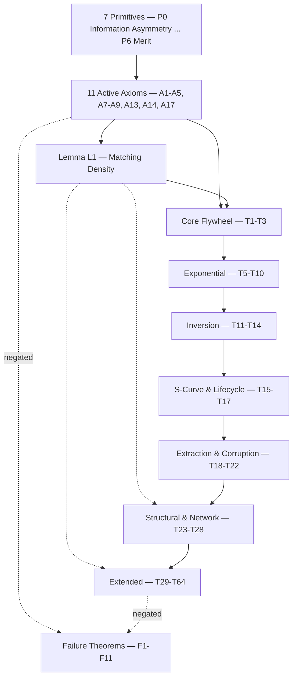

## What a theorem is here

Every theorem in this section is *derived*, not posited. Each one traces, through an explicit dependency chain, back to the seven primitives and the eleven active axioms (A1–A5, A7–A9, A13, A14, A17) — nothing hangs unsupported. Where an entry says "Derives from," that is a real proof obligation, not a citation: given the axioms and prior theorems listed, the theorem's conclusion follows.

One derived result is carried as a **lemma** rather than a theorem: **L1 (Matching Density)** states the scaling in membership that A4 implies but does not itself assert, and T2, T26 and T29 cite it directly. It is a scaling property of A4, not an additional claim, which is why it is numbered apart from the theorem set.

That derivation is conditional on one thing: **P6 (Merit) — contribution should determine reward.** P6 is the framework's only normative primitive; everything else (P0–P5 and the axioms built on them) is descriptive — a claim about how selection-driven systems evolve wherever information asymmetry creates pressure to resolve it. Strip out P6 and the theorems still hold as descriptive claims about those dynamics: the flywheel still self-accelerates, $e^X$ is still algebraic. What P6 adds is the normative reading — that this direction of evolution is a good one. Reject P6 and you reject the framework's conclusions in the same breath; the mechanics remain true either way.

## How the groups relate

The groups below are not independent chapters — they are stages of one derivation. Core Flywheel and Exponential establish that growth compounds and specify how. Inversion and Extraction show what has to be true structurally for that compounding to stay honest. S-Curve and Structural describe the shape growth takes and how the protocol organizes around it. Extended Theorems carries the same derivation into the protocol's transition path, its certification architecture, a cross-check against prior economic theory, and its monetary design. Failure Theorems is the mirror image of all of it: the same dependency chains, run in reverse, showing exactly what breaks and how to detect it.

| Group | Theorems | Page |
|---|---|---|
| Matching Density (lemma) | L1 | [Core Flywheel](/specification/theorems/core-flywheel) |
| Core Flywheel | T1–T3 (T4 absorbed into T11) | [Core Flywheel](/specification/theorems/core-flywheel) |
| Exponential | T5–T10 | [Exponential](/specification/theorems/exponential) |
| Inversion | T11–T14 | [Inversion](/specification/theorems/inversion) |
| S-Curve & Lifecycle | T15–T17 | [S-Curve](/specification/theorems/s-curve) |
| Extraction & Corruption | T18–T22 | [Extraction](/specification/theorems/extraction) |
| Structural & Network Corollaries | T23–T28 | [Structural](/specification/theorems/structural) |
| Extended (transition, certification, Nobel cross-check, monetary) | T29–T64 | [Extended Theorems](/specification/theorems/extended) |
| Failure Theorems + Named Principles | F1–F11 | [Failure Theorems](/specification/theorems/failure) |

**Total: 74 active theorems — 63 positive + 11 failure — plus the lemma L1.** (T4 is absorbed into T11 and does not count separately; T62, T63 and F11 joined the active set at v14 with the adoption of A17; L1 is a lemma and is counted apart from the theorems.) Twenty-one formal proofs exist; six are published as standalone [proof pages](/specification/proofs), and the rest are referenced inline as "Proof N in the constitution."

The tenth failure theorem is **F10 (Surplus Not Retained)**, the second way Inheritance fails: F1 breaks the α channel, F10 breaks the retention channel. Every other operational force has exactly one failure mode. The eleventh is **F11 (Anchor Compromise)**, which is not a force failure at all: it is what happens when the external reference an attestation is checked against is one the protocol controls, and certification collapses into self-certification.

## Dependency graph

At the group level, dependency runs one direction — down from primitives and axioms, forward through the theorem groups — with the failure theorems drawing on the same axioms and later theorems from the opposite side (negated). The lemma L1 sits between the axioms and the theorems: it is derived from A4 alone, and the dotted edges are the theorems that cite it outside the flywheel group (T26 structural, T29 extended).

Each group page carries the full per-theorem dependency chain (`A1+A2+A4...`) for every entry. The constitution's own dependency graph (§V) and cross-validation matrix (§VI) are the canonical source if a chain here needs auditing against the original.
